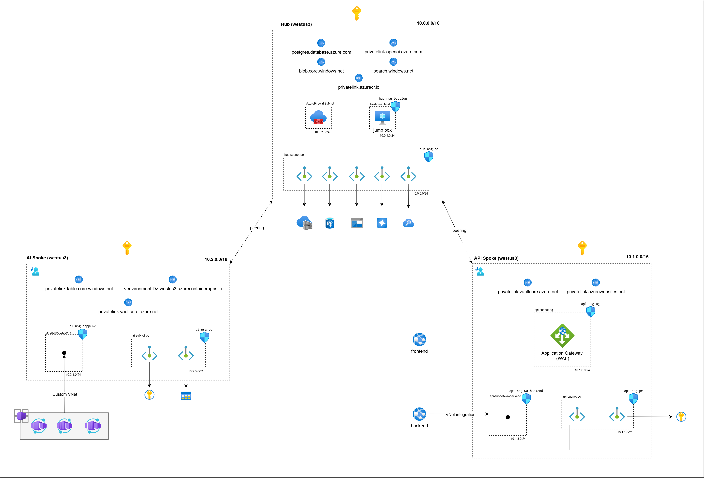
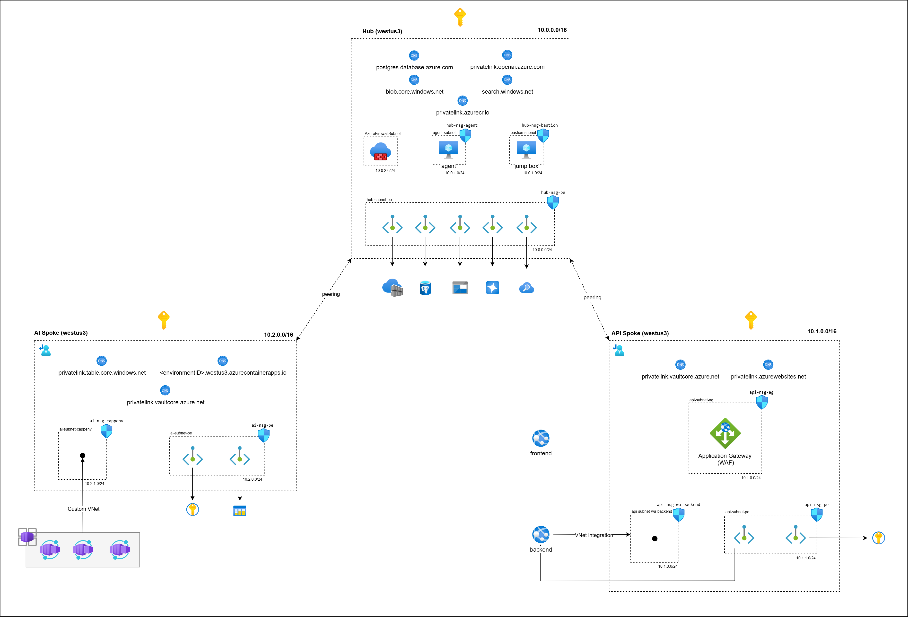

# Azure Hub-Spoke Architecture for RAG-Based Applications



## 📋 Table of Contents

- [Executive Summary](#executive-summary)
- [Architecture Overview](#architecture-overview)
  - [Network Topology](#network-topology)
  - [Hub-Spoke Connectivity](#hub-spoke-connectivity)
  - [Subnet Architecture](#subnet-architecture)
  - [Private DNS Architecture](#private-dns-architecture)
  - [Security Layers](#security-layers)
  - [Traffic Flows](#traffic-flows)
  - [Azure Firewall Configuration](#azure-firewall-configuration)
  - [Architecture Diagram](#architecture-diagram)
- [Configuration](#configuration)
  - [Configuration Files Structure](#configuration-files-structure)
  - [config.tfvars - Non-Sensitive Configuration](#configtfvars---non-sensitive-configuration)
  - [secrets.tfvars - Sensitive Configuration](#secretstfvars---sensitive-configuration)
  - [Setting Up Configuration](#setting-up-configuration)
  - [Important Configuration Notes](#important-configuration-notes)

---

## Executive Summary

This Terraform implementation deploys a **production-grade hub-spoke network architecture on Azure**, specifically designed for hosting **RAG (Retrieval-Augmented Generation) based applications**. The infrastructure provides a secure, scalable foundation for AI-powered applications that require integration with Azure OpenAI, cognitive search, and data storage services.

### What This Infrastructure Provides

The solution implements a **three-network topology** consisting of:
- A **central hub network** that hosts shared AI services (Azure OpenAI, AI Search, PostgreSQL, Blob Storage, Azure Container Registry)
- An **API spoke network** for web application (frontend + backend) with Application Gateway ingress
- An **AI spoke network** for AI containerized workloads running on Azure Container Apps

Azure Firewall serves as a **secure router between spoke networks**, while **Application Gateway handles all inbound traffic** from the internet. All Azure PaaS services are accessed through **private endpoints**, eliminating public internet exposure. The architecture uses **managed identities**, removing the need for credential management.

### Core Capabilities

**Fully Configurable Infrastructure:**
- Network topology (VNet address spaces, subnet ranges, peering configurations)
- Compute resources (VM sizes, OS images, public IP settings)
- Security components (NSG rules, firewall policies, WAF settings)
- Storage accounts (tiers, replication types, network rules)
- AI/ML services (OpenAI models, AI Search tiers, embeddings)
- Database configurations (PostgreSQL versions, storage, authentication)
- Container platform (Apps Environment, workload profiles, scaling)
- Web applications (App Service plans, container images, settings)
- Application Gateway (SSL certificates, routing rules, health probes)
- Managed identities and RBAC assignments
- DNS zones and private endpoint configurations

**Security & Compliance:**
- Zero-trust networking with private endpoints (9+ endpoints across all networks)
- Application Gateway with WAF v2 (OWASP protection, DDoS mitigation)
- Azure Firewall for spoke-to-spoke routing and traffic inspection
- Network Security Groups (NSGs) on all subnets with granular rules
- User-Defined Routes (UDR) for forced tunneling through firewall
- Managed identities (2 user-assigned, multiple system-assigned)
- 20+ RBAC role assignments with least privilege access
- Network isolation with storage account firewall rules (deny by default)
- SSL/TLS termination at Application Gateway
- Minimum TLS 1.2 enforcement across all services
- Key Vault with soft delete and purge protection
- Private DNS zones for all PaaS service resolution
- VNet integration for Web Apps (no public exposure)
- Container Apps with optional mutual TLS
- ACR with private endpoint and no public access

---

## 🎯 Use Cases

This architecture is ideal for:
- **RAG-based chatbots and Q&A systems** that need secure access to Azure OpenAI
- **Document intelligence applications** combining AI Search with GPT models
- **Enterprise AI applications** requiring private connectivity to AI services
- **Microservices architectures** where AI workloads run in containers
- **Hybrid scenarios** where on-premises systems need secure cloud AI access

---

## 🏛️ Architecture Overview

### 🌐 Network Topology

The infrastructure implements a **hub-spoke network model** with three Virtual Networks (VNets):

| Network | Address Space | Purpose | Resource Group |
|---------|--------------|---------|----------------|
| **Hub VNet** | 10.0.0.0/16 | Shared services, AI resources, and network routing | `{region}-hub-rg` |
| **API Spoke VNet** | 10.1.0.0/16 | Web application delivery and internet ingress | `{region}-api-rg` |
| **AI Spoke VNet** | 10.2.0.0/16 | Container-based AI workloads | `{region}-ai-rg` |

### 🔗 Hub-Spoke Connectivity

The networks are connected through **bidirectional VNet peering**:
- Hub <-> API Spoke (direct peering)
- Hub <-> AI Spoke (direct peering)
- API Spoke <-> AI Spoke (routed through Azure Firewall in hub)

This design ensures that:
1. **Spoke-to-spoke traffic** is routed through Azure Firewall for inspection and control
2. Shared services in the hub are directly accessible from both spokes
3. Network segmentation is maintained between workload types

### 🏗️ Subnet Architecture

**Hub Network Subnets:**
- `10.0.1.0/24` - Private Endpoints subnet (for all hub PaaS services)
- `10.0.2.0/24` - VM subnet (management jumpbox)
- `10.0.3.0/24` - AzureFirewallSubnet

**API Spoke Subnets:**
- `10.1.1.0/24` - Application Gateway subnet
- `10.1.2.0/24` - Azure App Service subnet for backend (VNet integrated)
- `10.1.3.0/24` - Private Endpoints subnet

**AI Spoke Subnets:**
- `10.2.1.0/23` - Container Apps Environment subnet
- `10.2.3.0/24` - Private Endpoints subnet

### 🔐 Private DNS Architecture

The solution implements **10 Private DNS Zones** for private endpoint resolution:

| DNS Zone | Service | Location | Linked VNets |
|----------|---------|----------|--------------|
| privatelink.blob.core.windows.net | Blob Storage | Hub | Hub, API, AI |
| privatelink.table.core.windows.net | Table Storage | AI Spoke | AI |
| privatelink.openai.azure.com | Azure OpenAI | Hub | Hub, API, AI |
| privatelink.search.windows.net | AI Search | Hub | Hub, API, AI |
| privatelink.postgres.database.azure.com | PostgreSQL | Hub | Hub, API, AI |
| privatelink.azurecr.io | Container Registry | Hub | Hub, API, AI |
| privatelink.azurewebsites.net | Web Apps | API Spoke | API |
| privatelink.vaultcore.azure.net | Key Vault (API) | API Spoke | API |
| privatelink.vaultcore.azure.net | Key Vault (AI) | AI Spoke | AI |
| [Container Apps Domain] | Container Apps Environment | AI Spoke | Hub, API, AI |

Each private endpoint automatically registers its private IP in the corresponding DNS zone, ensuring services resolve to private IPs (10.x.x.x) instead of public endpoints.

### 🛡️ Security Layers

The architecture implements **defense in depth** with multiple security layers:

1. **Network Security**
   - **Application Gateway with WAF v2** for internet ingress and SSL termination
   - **Azure Firewall** for spoke-to-spoke routing and traffic inspection
   - Network Security Groups (NSGs) on all subnets
   - Storage account network rules (deny by default)
   - Private endpoints eliminate public exposure

2. **Identity & Access**

   **User-Assigned Managed Identities (2):**
   - `ai_container_apps_identity` - Used by Container Apps in AI spoke
   - `app_gateway_identity` - Used by Application Gateway for Key Vault access

   **System-Assigned Managed Identities:**
   - **Web App Backend** - System-assigned identity for accessing hub services
   - **Hub VM** - System-assigned identity for management operations

   **RBAC Assignments (20+ roles):**
   - Web App Backend - Blob Storage (Storage Blob Data Contributor)
   - Web App Backend - PostgreSQL (Contributor)
   - Web App Backend - AI Search (Search Service Contributor)
   - Web App Backend - Azure OpenAI (Cognitive Services User)
   - Web App Backend - ACR (AcrPull)
   - Web App Backend - Key Vault (Key Vault Secrets User)
   - Hub VM - All services for management operations
   - Container Apps Identity - All hub services + AI storage + Key Vault
   - App Gateway Identity - (Key Vault Secrets User)

3. **Application Security**
   - **Application Gateway** handles SSL/TLS termination
   - WAF v2 protection against OWASP threats

### 🚦 Traffic Flows

**Inbound Traffic (Internet to Application):**
```
Internet -> Application Gateway (SSL termination) -> Backend Web App (via private endpoint)
```

**Spoke-to-Spoke Traffic:**
```
API Spoke -> Azure Firewall (hub) -> AI Spoke
```
- Enforced via User-Defined Routes (UDR)
- Firewall network rule allows TCP traffic from API spoke (10.1.0.0/16) to AI spoke (10.2.0.0/16)

**Service Access (via Private Endpoints):**
```
Web Apps/Container Apps -> Private Endpoint -> Azure PaaS Service
```
- All PaaS services accessed through private IPs
- DNS resolution handled by Private DNS Zones

### 🔥 Azure Firewall Configuration

The Azure Firewall serves as a **secure router** between spokes:
- **Public IP** for outbound SNAT only (not for inbound traffic)
- **Network Rule Collection** "Allow-Spoke-To-Spoke-Traffic"
- Routes enforced via UDR on spoke subnets

### 📊 Architecture Diagram



---

## ⚙️ Configuration

The infrastructure is fully configurable through two configuration files located in `configuration/terraform/`:

### 📁 Configuration Files Structure

| File | Purpose | Git Status |
|------|---------|------------|
| **`config.tfvars`** | Non-sensitive infrastructure configuration | Can be committed | 
| **`secrets.tfvars`** | Sensitive values (passwords, keys, tokens) | Must be in .gitignore | 

### 📝 config.tfvars - Non-Sensitive Configuration

This file contains all non-sensitive configuration values organized into sections:

**1. Global Configuration**
- Azure subscription ID
- Naming conventions (company, product, environment, region)
- Resource group names

**2. Network Configuration**
- VNet address spaces (default: 10.0.0.0/16, 10.1.0.0/16, 10.2.0.0/16)
- Subnet CIDR blocks for each network segment
- NSG rules and allowed IP addresses
- Azure Firewall configuration

**3. Compute Resources**
- VM sizes and OS configurations (Ubuntu 22.04 LTS default)
- Public IP settings
- Container Apps scaling (min: 0, max: 3 replicas)
- Web App service plans (B1, P1v2 SKUs)

**4. Azure AI/ML Services**
- OpenAI models (GPT-4, text-embedding-3-small)
- AI Search tiers (standard, with semantic search)
- Custom subdomains and capacities

**5. Storage Configuration**
- Storage account tiers (Standard)
- Replication types (GRS, LRS)
- Container and table storage settings

**6. Database Configuration**
- PostgreSQL version (12) and SKU (GP_Standard_D2s_v3)
- Storage size (32GB) and tier
- Authentication methods (AD + password)

**7. Security Settings**
- WAF policies and rules
- SSL certificate paths
- Allowed SSH sources
- Container registry settings

**8. Application Settings**
- Container image names
- Environment variables
- Application Insights configuration
- Frontend/backend URLs

### 🔒 secrets.tfvars - Sensitive Configuration

This file contains all sensitive values (vm password, ...)
